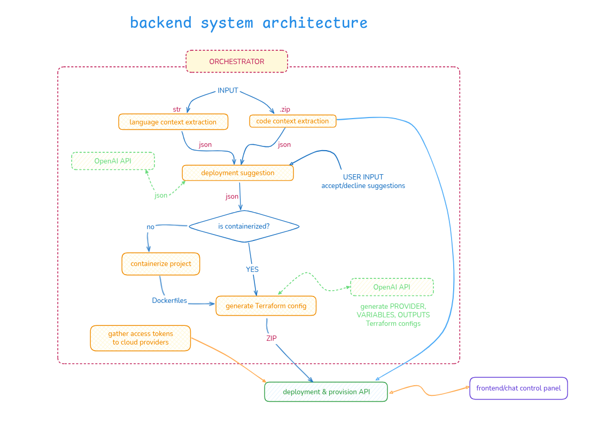
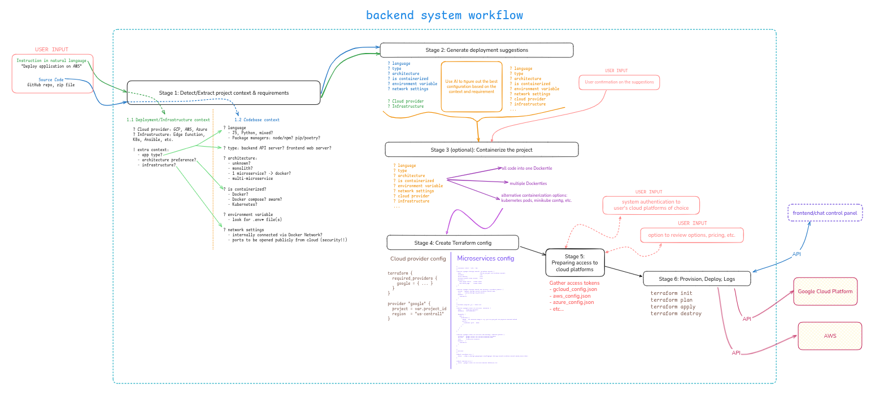

# Arvo-ADCS

- An automated deployment chat-ish system. Backend-focus
- Designed (entirely) by @notkaramel, implemented with the help of ChatGPT 5 and Gemini 2.5 Flash.
- To get started:
  - Copy `.env.sample` and rename the new file to `.env`
  - Add your OpenAI API to `.env`
  - Run, and assuming you have Docker ready
  ```sh
  docker compose build
  docker compose up
  ```
  - The mock-up frontend is available at localhost:3000

## System design & architecture

- [Excalidraw - View the full system sketch](https://excalidraw.com/#json=gInCXAHm8vH-obkX1AcWq,J8VFlhV40FrXe3AYpPRxRw)

- Backend System Architecture
  

- Backend Orchestration Workflow
  

## API

- Input to Orchestrator: http://orchestrator:8080/upload or http://localhost:8080/upload
- Request body requires:
  - Deployment Instruction `instruction`, string type
  - ZIP file of the project

## Project structure

```
src/
├── deploy        # deployment service
├── frontend      # frontend chat interface
├── orchestrator  # backend orchestrator, handling the services
└── services
    ├── codebase-context
    ├── containerize-project
    ├── deployment-suggestion
    ├── generate-terraform
    └── language-context
```

## Implementation phase

- Orchestrator
- Microservices, in order of stages
  | Microservice | Order | Input | Output |
  | ------------------------- | ----- | -------------------------------------------------- | --------------------------------------------------------------------------------------------------- |
  | **language-context** | 1.1 | `instruction` string | JSON: `cloud_provider`, `infrastructure`, etc. |
  | **codebase-context** | 1.2 | `repo_zip` | JSON: language, package manager, app type, architecture, containerized, env, network |
  | **deployment-suggestion** | 2 | language + codebase context | JSON: `suggestion_text`, `type` (`single-docker`, `multi-docker`, `kubernetes-minikube`) |
  | **containerize-project** | 3 | `repo_zip`, `suggestion` | Skip if project already containerized; otherwise generates Dockerfile/docker-compose ZIP |
  | **generate-terraform** | 4 | language + codebase context, environment variables | Terraform config files for suggested cloud platforms. Bundled with code zip |
  | **gather-access-tokens** (not done) | 5 | Deployment suggestions | JSON file(s) of user's write access tokens and necessary credentials on cloud platform for project creation |
  | **deploy-with-terraform** (not done) | 6 | Terraform config + containerized project | Starts deployment, exposes API endpoints to monitor/supervise, returns deployment status |

## Sample Output

After "Generate Terraform" stage, users should be able to retrieve a zip file containing their original project + Terraform configured files. Here's the sample output from "Deploy my project to Google Cloud" with the _`hello_world.zip`_ project

```
[antoine@LunarEclipse:~/Partage/Projects/Arvo-ADCS on main]
% tree terraform_generated
terraform_generated
├── hello_world_webserver-main
│   ├── app
│   │   ├── app.py
│   │   ├── requirements.txt
│   │   ├── static
│   │   │   └── style.css
│   │   └── templates
│   │       └── index.html
│   └── README.md
├── main.tf
├── outputs.tf
├── provider.tf
├── README.md
├── terraform_config.json
└── variables.tf

5 directories, 11 files
```

## Archived design notes

- Updated attempt:

  - Full system sketch: https://excalidraw.com/#json=3T5yRD1cPPOXs3K85h0fV,7p1pSMCrBKGi2ZZ-5tcmVg
  - 

- First attempt:
  - Full system sketch https://excalidraw.com/#json=jxKZ8GsbIm_8_ZP-0-nGZ,IblhtM3I1DW1aoGsxCA71Q
  - 
  - 
